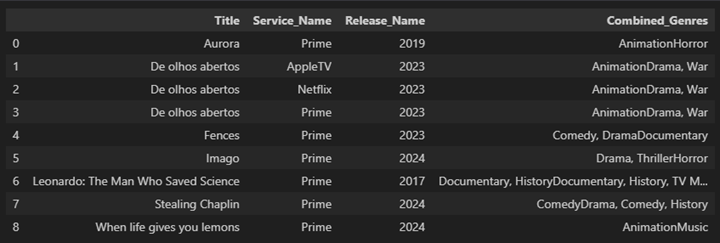
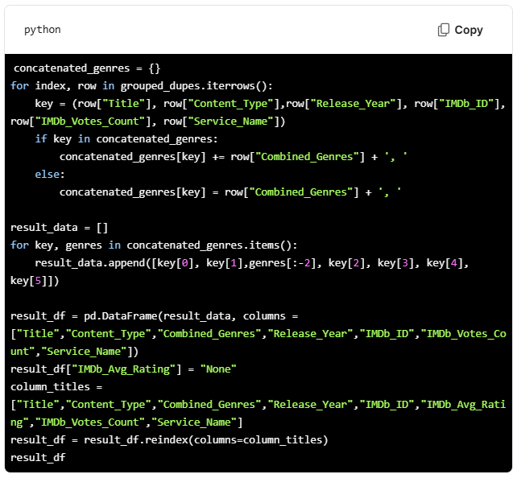

# NOTE 1: 
I initially worked with Danny Morton regarding a row/column concatenation problem I was experiencing. We had some set-backs and later Danny sent me some code that followed the code below, but the code below includes my df and column names. Danny used AI to assist with the code he provided me on. 

Original Code: 
concatenated_genres = {} 
for index, row in grouped_dupes.iterrows(): 
key = (row["Title"], row["Service_Name"], row["Release_Year"]) 
if key in concatenated_genres: 
concatenated_genres[key] += row["Combined_Genres"] 
else: 
concatenated_genres[key] = row["Combined_Genres"] 
result_data = [] 
for key, genres in concatenated_genres.items(): 
result_data.append([key[0], key[1], key[2], genres]) 

result_df = pd.DataFrame(result_data, columns = ["Title","Service_Name","Release_Name","Combined_Genres"]) 
result_df

Original Code Output: 

I updated my code to include more columns and a column reodering in the df, and then plugged my code into the Brave Browser’s AI Chat, named “Leo AI” and asked the following question: 

concatenated_genres = {} 
for index, row in grouped_dupes.iterrows(): 
key = (row["Title"], row["Content_Type"],row["Release_Year"], row["IMDb_ID"], row["IMDb_Votes_Count"], row["Service_Name"]) 
if key in concatenated_genres: 
concatenated_genres[key] += row["Combined_Genres"] 
else: 
concatenated_genres[key] = row["Combined_Genres"] 
result_data = [] 
for key, genres in concatenated_genres.items(): 
result_data.append([key[0], key[1],genres, key[2], key[3], key[4], key[5]]) 

result_df = pd.DataFrame(result_data, columns=["Title","Content_Type","Combined_Genres","Release_Year","IMDb_ID","IMDb_Votes_Count","Service_Name"]) 
result_df["IMDb_Avg_Rating"] = "None" 
column_titles=["Title","Content_Type","Combined_Genres","Release_Year","IMDb_ID","IMDb_Avg_Rating","IMDb_Votes_Count","Service_Name"] 
result_df = result_df.reindex(columns=column_titles) 
result_df

Leo’s response was as follows: 

Leo
To add a comma between the Combined_Genres, you can use the str.replace method in Pandas. Here's how you can modify your code:

Leo Continued: In this modified code, I added a comma and a space after the Combined_Genres when concatenating them. Then, when appending the data to result_data, I used genres[:-2] to remove the extra comma and space at the end.